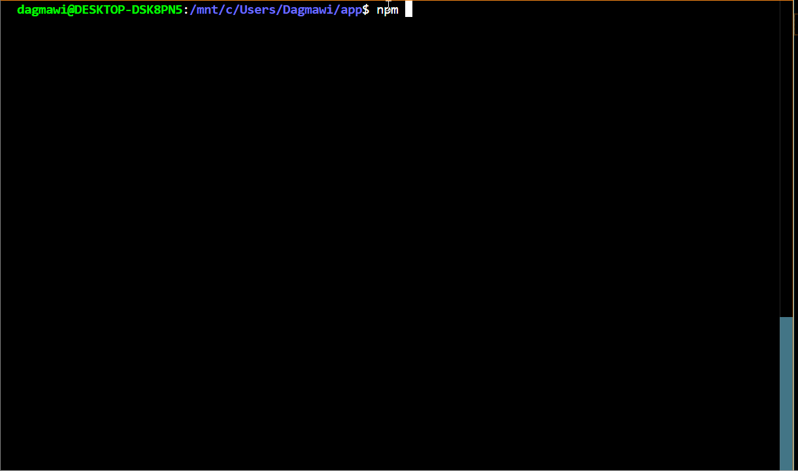

# Vibetune

[](https://bestpractices.coreinfrastructure.org/projects/569) [](https://goreportcard.com/report/github.com/kubernetes/kubernetes) 


----
VibeTune is a locally hosted desktop application that builds upon the Spotify API to help you discover music, share your music tastes and connect with other listeners. This prototype supports basic track search, music playback, user sessions, chats, and vibe matching. 
 

VibeTune is maintained as a passionate project. If you're interested in open contribution, contact the developers.


## 🌟 Features

- **Interactive Maps**: Discover places and plan routes with real-time data using Google Maps API.
- **Tailored Playlists**: Spotify-powered playlists matched to your mood and location.
- **Real-Time Heatmaps**: Visualize environmental conditions like air quality and crowd density.
- **Secure Data**: User data and Spotify tokens are stored securely using Firebase Firestore.


### Interactive Dashboard
*All your vibes, in one place.*

### Real-Time Heatmaps
*Explore air quality and environmental data seamlessly.*

### Spotify Integration
*Sync your favorite tunes and discover playlists.*

## 🔧 Technologies Used

- **Frontend**: React for a dynamic user interface.
- **APIs**: Google Maps API for interactive maps, Spotify Web API for music integration.
- **Backend**: Node.js for handling API requests.
- **Database**: Firebase Firestore for secure storage.
- **AI**: OpenAI API for AI-driven insights and recommendations.

## 📜 Installation Guide

### Prerequisites

- Node.js (v16+)
- Firebase CLI
- Spotify Developer Account

### Steps

1. **Clone the Repository**:
    ```bash
    git clone https://github.com/d-negatu/vibetune.git
    cd vibetune
    ```

2. **Install Dependencies**:
    ```bash
    npm install
    ```

3. **Configure Environment Variables**:
    Create a `.env` file in the root directory with the following details:
    ```env
    SPOTIFY_CLIENT_ID=your_spotify_client_id
    SPOTIFY_CLIENT_SECRET=your_spotify_client_secret
    REDIRECT_URI=http://localhost:3000/callback
    FIREBASE_PROJECT_ID=your_firebase_project_id
    ```

4. **Start the Development Server**:
    ```bash
    npm run dev
    ```
    

## 📂 Project Structure

```bash
├── src/
│   ├── components/
│   │   ├── GoogleMapsComponent.js
│   │   ├── SpotifyPlayer.js
│   ├── services/
│   │   ├── spotifyService.js
│   │   ├── mapService.js
│   ├── App.js
├── functions/
│   ├── index.js
│   ├── retrieveTokens.js
├── .env
├── package.json
└── README.md
